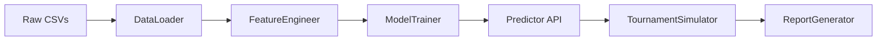

# Design Document: FIFA World Cup Predictor

## Overview

The FIFA World Cup Predictor is an end-to-end machine learning pipeline implemented in Python. It ingests three historical CSV datasets (WorldCupMatches, WorldCupPlayers, WorldCups), engineers team-level features with strict temporal leakage prevention, trains a gradient boosting classifier to predict match outcomes (Home Win / Away Win / Draw), exposes a head-to-head prediction API, and runs a Monte Carlo tournament bracket simulation to estimate each team's probability of winning the World Cup.

The primary deliverable is a Jupyter notebook (`worldCup.ipynb`) backed by importable Python modules so that each pipeline stage can be tested independently.

### Design Goals

- Strict temporal integrity: no future data leaks into training features
- Reproducible results: serialised model + fixed random seeds
- Modular: each pipeline stage is a standalone class/function
- Observable: rich visualisations and a summary CSV for every run

---

## Architecture

The system is organised as a linear pipeline with five stages:



Each stage is a Python class. The notebook orchestrates them in sequence. Stages communicate via pandas DataFrames and scikit-learn–compatible objects.

### Module Layout

```
worldCup.ipynb          # orchestration notebook
predictor/
  __init__.py
  data_loader.py        # Requirement 1 – DataLoader
  feature_engineer.py   # Requirement 2 – FeatureEngineer
  model_trainer.py      # Requirement 3 – ModelTrainer
  predictor_api.py      # Requirement 4 – PredictorAPI
  simulator.py          # Requirement 5 – TournamentSimulator
  reporter.py           # Requirement 6 – ReportGenerator
  config.py             # shared constants / paths
```

---

## Components and Interfaces

### DataLoader (`data_loader.py`)

Responsible for loading and validating the three raw CSV files.

```python
class DataLoader:
    def __init__(self, data_dir: str): ...

    def load(self) -> tuple[pd.DataFrame, pd.DataFrame, pd.DataFrame]:
        """Returns (matches_df, players_df, cups_df).
        Raises FileNotFoundError for missing files.
        Logs warnings and drops rows with nulls in required columns.
        Deduplicates on MatchID, keeping first occurrence."""
```

Required columns validated per file:

| File | Required columns |
|------|-----------------|
| WorldCupMatches.csv | Year, Home Team Name, Away Team Name, Home Team Goals, Away Team Goals, MatchID, Stage, Datetime |
| WorldCupPlayers.csv | MatchID, Team Initials, Player Name, Event |
| WorldCups.csv | Year, Winner |

### FeatureEngineer (`feature_engineer.py`)

Derives the `Team_Feature_Vector` for every match row.

```python
class FeatureEngineer:
    def __init__(self, matches_df, players_df): ...

    def build_features(self) -> pd.DataFrame:
        """Returns a training DataFrame with one row per team per match
        (symmetric augmentation) and all engineered features."""
```

Key internal methods:

- `_rolling_team_stats(year)` – computes win/draw/loss rate, avg goals scored/conceded, avg goal diff using only matches with `Year < year`
- `_head_to_head_stats(team_a, team_b, year)` – h2h win rate, draw rate, avg goal diff before `year`
- `_player_aggregates(team, year)` – avg goal events per player from WorldCupPlayers before `year`
- `_encode_stage(stage_str)` – ordinal encoding
- `_fill_cold_start(df)` – replaces NaN rolling stats with global column mean for teams with < 3 appearances

### ModelTrainer (`model_trainer.py`)

Trains and evaluates the gradient boosting classifier.

```python
class ModelTrainer:
    def __init__(self, features_df: pd.DataFrame, cutoff_year: int, model_path: str): ...

    def train(self) -> TrainResult:
        """Temporal split, hyperparameter search, fit, evaluate."""

    def save(self): ...

    @staticmethod
    def load(model_path: str) -> "ModelTrainer": ...
```

`TrainResult` is a dataclass holding the fitted estimator, test metrics dict, and feature importance series.

### PredictorAPI (`predictor_api.py`)

Thin wrapper around the trained model for interactive queries.

```python
class PredictorAPI:
    def __init__(self, model, feature_engineer: FeatureEngineer): ...

    def predict(self, home_team: str, away_team: str) -> MatchPrediction:
        """Returns MatchPrediction(home_win_prob, away_win_prob, draw_prob, predicted_label).
        Raises ValueError for unrecognised team names.
        Team name lookup is case-insensitive."""
```

`MatchPrediction` is a dataclass; `home_win_prob + away_win_prob + draw_prob` must sum to 1.0 ± 1e-6.

### TournamentSimulator (`simulator.py`)

Monte Carlo bracket simulation.

```python
class TournamentSimulator:
    def __init__(self, predictor: PredictorAPI, n_runs: int = 1000, seed: int = 42): ...

    def simulate(
        self,
        teams: list[str],
        groups: dict[str, list[str]]
    ) -> SimulationResult:
        """Runs n_runs full brackets and returns per-team win/sf/final probabilities."""
```

`SimulationResult` exposes:
- `win_probabilities: dict[str, float]` – sums to 1.0 ± 1e-4
- `semifinal_probabilities: dict[str, float]`
- `final_probabilities: dict[str, float]`
- `ranked_teams: list[str]` – sorted descending by win probability

### ReportGenerator (`reporter.py`)

Produces all output artefacts.

```python
class ReportGenerator:
    def __init__(self, output_dir: str): ...

    def bar_chart(self, sim_result: SimulationResult): ...
    def confusion_matrix(self, y_true, y_pred): ...
    def feature_importance(self, importance_series: pd.Series): ...
    def summary_csv(self, sim_result: SimulationResult): ...
```

All charts saved as PNG to `output_dir`. Summary CSV columns: `team, win_prob, semifinal_prob, final_prob`.

---

## Data Models

### Raw DataFrames (post-load)

**matches_df** – one row per historical match

| Column | Type | Notes |
|--------|------|-------|
| Year | int | parsed from Datetime |
| Stage | str | raw stage string |
| Home Team Name | str | |
| Away Team Name | str | |
| Home Team Goals | int | |
| Away Team Goals | int | |
| MatchID | int | deduplicated |
| Datetime | datetime | parsed |

**players_df** – one row per player appearance

| Column | Type |
|--------|------|
| MatchID | int |
| Team Initials | str |
| Player Name | str |
| Event | str (nullable) |

**cups_df** – one row per tournament

| Column | Type |
|--------|------|
| Year | int |
| Winner | str |

### Team_Feature_Vector (training row)

| Feature | Description |
|---------|-------------|
| team_win_rate | rolling win rate for the focal team |
| team_draw_rate | rolling draw rate |
| team_loss_rate | rolling loss rate |
| team_avg_goals_scored | rolling avg goals scored |
| team_avg_goals_conceded | rolling avg goals conceded |
| team_avg_goal_diff | rolling avg goal difference |
| opp_win_rate | same stats for opponent |
| opp_draw_rate | |
| opp_loss_rate | |
| opp_avg_goals_scored | |
| opp_avg_goals_conceded | |
| opp_avg_goal_diff | |
| h2h_team_win_rate | head-to-head win rate (team vs opp) |
| h2h_draw_rate | head-to-head draw rate |
| h2h_avg_goal_diff | head-to-head avg goal diff |
| stage_ordinal | 1–6 ordinal encoding |
| team_avg_goal_events_per_player | player aggregate from WorldCupPlayers |
| opp_avg_goal_events_per_player | |
| year | numeric year of the match |

**Target**: `outcome` ∈ {`Home Win`, `Away Win`, `Draw`}

### Outcome Encoding

| Label | Integer |
|-------|---------|
| Home Win | 0 |
| Draw | 1 |
| Away Win | 2 |

### Stage Ordinal Encoding

| Stage string | Ordinal |
|-------------|---------|
| Group Stage / Group * | 1 |
| Round of 16 | 2 |
| Quarter-finals | 3 |
| Semi-finals | 4 |
| Third place | 5 |
| Final | 6 |

### Serialised Model File

The trained model is persisted with `joblib.dump` to `<model_path>/match_outcome_model.joblib`. The file stores the full scikit-learn pipeline (preprocessor + estimator) so that feature names and scaling are preserved across load/save cycles.

---

## Correctness Properties

*A property is a characteristic or behavior that should hold true across all valid executions of a system — essentially, a formal statement about what the system should do. Properties serve as the bridge between human-readable specifications and machine-verifiable correctness guarantees.*

### Property 1: Missing file raises descriptive error

*For any* one of the three required CSV filenames, if that file is absent from the data directory, `DataLoader.load()` shall raise an exception whose message identifies the missing filename.

**Validates: Requirements 1.2**

---

### Property 2: Null rows are excluded from output

*For any* matches DataFrame with rows containing null values in required columns (Year, Home Team Name, Away Team Name, Home Team Goals, Away Team Goals), the cleaned output DataFrame shall contain no rows where any of those columns is null.

**Validates: Requirements 1.3**

---

### Property 3: Deduplication retains first occurrence

*For any* matches DataFrame containing duplicate MatchID values, the deduplicated output shall contain exactly one row per MatchID and that row shall equal the first occurrence in the original DataFrame.

**Validates: Requirements 1.5**

---

### Property 4: Datetime parsing yields correct year

*For any* Datetime string in the source format (e.g. "13 Jul 1930 - 15:00"), the parsed `year` numeric feature shall equal the four-digit year present in that string.

**Validates: Requirements 1.4**

---

### Property 5: Rolling stats use only prior-year data (leakage prevention)

*For any* team and any match year Y, the rolling statistics (win rate, draw rate, loss rate, avg goals scored, avg goals conceded, avg goal diff) computed by `FeatureEngineer` shall be identical to the statistics computed using only the subset of historical matches where `Year < Y`.

**Validates: Requirements 2.1, 2.4**

---

### Property 6: Head-to-head stats use only prior-year data

*For any* pair of teams (A, B) and any match year Y, the head-to-head statistics computed by `FeatureEngineer` shall equal those computed from the subset of historical matches between A and B where `Year < Y`.

**Validates: Requirements 2.2, 2.4**

---

### Property 7: Symmetric augmentation produces exactly two rows per match

*For any* historical match record, `FeatureEngineer.build_features()` shall produce exactly two training rows referencing that match — one with the focal team in the "home" role and one in the "away" role.

**Validates: Requirements 2.5**

---

### Property 8: Cold-start teams have no NaN rolling stats

*For any* team with fewer than 3 prior World Cup appearances, all rolling statistic columns in the output feature DataFrame shall be non-null (filled with the global column mean).

**Validates: Requirements 2.7**

---

### Property 9: Player aggregate matches manual calculation

*For any* team and tournament year Y, the `team_avg_goal_events_per_player` feature shall equal `(number of goal events for that team in year Y) / (number of distinct players for that team in year Y)`, computed from WorldCupPlayers rows with `Year < Y`.

**Validates: Requirements 2.6**

---

### Property 10: Temporal split integrity

*For any* configurable cutoff year C, all rows in the training set shall have `Year < C` and all rows in the test set shall have `Year >= C`.

**Validates: Requirements 3.3**

---

### Property 11: Model output is a valid probability distribution

*For any* valid pair of team feature vectors, `model.predict_proba()` shall return a 3-element array where all values are in [0, 1] and the sum equals 1.0 within floating-point tolerance of 1e-6.

**Validates: Requirements 3.5**

---

### Property 12: Model serialisation round-trip

*For any* valid match input, saving the trained model to disk and reloading it shall produce `predict_proba` outputs identical (within 1e-9) to those of the original in-memory model.

**Validates: Requirements 3.7, 3.8**

---

### Property 13: API probability sum equals 1.0

*For any* valid pair of team names (home, away), `PredictorAPI.predict()` shall return a `MatchPrediction` where `home_win_prob + away_win_prob + draw_prob = 1.0` within 1e-6.

**Validates: Requirements 4.1, 4.5**

---

### Property 14: Predicted label equals argmax of probabilities

*For any* valid team pair, the `predicted_label` field of `MatchPrediction` shall equal the outcome class corresponding to the highest probability among the three outcome probabilities.

**Validates: Requirements 4.2**

---

### Property 15: Unknown team name raises ValueError

*For any* string not present in the known team name set (case-insensitively), passing it as either argument to `PredictorAPI.predict()` shall raise a `ValueError` whose message identifies the unrecognised name.

**Validates: Requirements 4.3**

---

### Property 16: Case-insensitive team name lookup

*For any* valid team name T and any case variant T' (e.g. upper, lower, mixed), `PredictorAPI.predict(T', opponent)` shall return the same `MatchPrediction` as `PredictorAPI.predict(T, opponent)`.

**Validates: Requirements 4.4**

---

### Property 17: Group stage advances exactly 2 teams per group

*For any* group configuration with N teams per group, after simulating the group stage, exactly 2 teams from each group shall advance to the knockout round.

**Validates: Requirements 5.2**

---

### Property 18: Tournament win probabilities sum to 1.0

*For any* valid 32-team input and any number of simulation runs ≥ 1, the sum of `win_probabilities` across all 32 teams in `SimulationResult` shall equal 1.0 within 1e-4.

**Validates: Requirements 5.4, 5.7**

---

### Property 19: Ranked output is sorted descending and complete

*For any* simulation result, `SimulationResult.ranked_teams` shall contain all 32 input teams exactly once, ordered by `win_probabilities` in non-increasing order.

**Validates: Requirements 5.5**

---

### Property 20: Charts are saved as PNG files to the output directory

*For any* configurable output directory path, after calling each chart-generation method (`bar_chart`, `confusion_matrix`, `feature_importance`), the corresponding `.png` file shall exist in that directory.

**Validates: Requirements 6.1, 6.2, 6.3, 6.4**

---

### Property 21: Summary CSV contains required columns and valid probabilities

*For any* simulation result, the summary CSV produced by `ReportGenerator.summary_csv()` shall contain columns `team`, `win_prob`, `semifinal_prob`, `final_prob`, all values shall be in [0, 1], and the `win_prob` column shall sum to 1.0 within 1e-4.

**Validates: Requirements 6.5**

---

## Error Handling

| Scenario | Component | Behaviour |
|----------|-----------|-----------|
| Missing CSV file | DataLoader | Raise `FileNotFoundError` with filename in message |
| Null in required column | DataLoader | Log `WARNING` with row count; drop rows |
| Duplicate MatchID | DataLoader | Log `INFO` with duplicate count; keep first |
| Unknown team name in predict | PredictorAPI | Raise `ValueError` with team name in message |
| Unknown team name in simulate | TournamentSimulator | Raise `ValueError` before simulation starts |
| Model file not found on load | ModelTrainer | Raise `FileNotFoundError` |
| Output directory does not exist | ReportGenerator | Create directory with `os.makedirs(exist_ok=True)` |
| n_runs < 1 | TournamentSimulator | Raise `ValueError` |
| Cutoff year outside data range | ModelTrainer | Raise `ValueError` with available year range |

All errors are propagated to the caller; the system does not silently swallow exceptions beyond the null-row and duplicate-row cases (which are logged and handled gracefully).

---

## Testing Strategy

### Dual Testing Approach

Both unit tests and property-based tests are required. They are complementary:

- **Unit tests** cover specific examples, integration points, and error conditions
- **Property-based tests** verify universal invariants across randomly generated inputs

### Property-Based Testing

Library: **Hypothesis** (Python)

Each property-based test runs a minimum of **100 iterations** (configured via `@settings(max_examples=100)`).

Each test is tagged with a comment in the format:
`# Feature: fifa-wc-predictor, Property N: <property_text>`

Mapping of design properties to test functions:

| Property | Test function | Pattern |
|----------|--------------|---------|
| 1 | `test_missing_file_raises_error` | Error condition |
| 2 | `test_null_rows_excluded` | Invariant |
| 3 | `test_deduplication_retains_first` | Invariant |
| 4 | `test_datetime_parsing_year` | Round-trip |
| 5 | `test_rolling_stats_no_leakage` | Invariant |
| 6 | `test_h2h_stats_no_leakage` | Invariant |
| 7 | `test_symmetric_augmentation` | Invariant (count) |
| 8 | `test_cold_start_no_nan` | Invariant |
| 9 | `test_player_aggregate_correctness` | Model-based |
| 10 | `test_temporal_split_integrity` | Invariant |
| 11 | `test_model_output_probability_simplex` | Invariant |
| 12 | `test_model_serialisation_round_trip` | Round-trip |
| 13 | `test_api_probability_sum` | Invariant |
| 14 | `test_predicted_label_is_argmax` | Invariant |
| 15 | `test_unknown_team_raises_value_error` | Error condition |
| 16 | `test_case_insensitive_lookup` | Metamorphic |
| 17 | `test_group_stage_advances_two_per_group` | Invariant |
| 18 | `test_tournament_win_probs_sum_to_one` | Invariant |
| 19 | `test_ranked_output_sorted_and_complete` | Invariant |
| 20 | `test_charts_saved_as_png` | Example |
| 21 | `test_summary_csv_columns_and_probs` | Invariant |

### Unit Tests

Unit tests (pytest) cover:

- `DataLoader` loads all three files successfully from a temp directory (Req 1.1)
- `ModelTrainer` produces a model with exactly three classes (Req 3.1, 3.2)
- `ModelTrainer` reports metrics dict with keys `accuracy`, `precision`, `recall`, `f1` (Req 3.4)
- `TournamentSimulator` accepts a 32-team input without error (Req 5.1)
- Stage ordinal encoding maps all known stage strings to correct integers (Req 2.3)

### Test File Layout

```
tests/
  test_data_loader.py
  test_feature_engineer.py
  test_model_trainer.py
  test_predictor_api.py
  test_simulator.py
  test_reporter.py
  conftest.py          # shared fixtures (sample DataFrames, temp dirs)
```

### Running Tests

```bash
pytest tests/ --tb=short -q
```

For property tests only:

```bash
pytest tests/ -k "property" --hypothesis-seed=0
```
